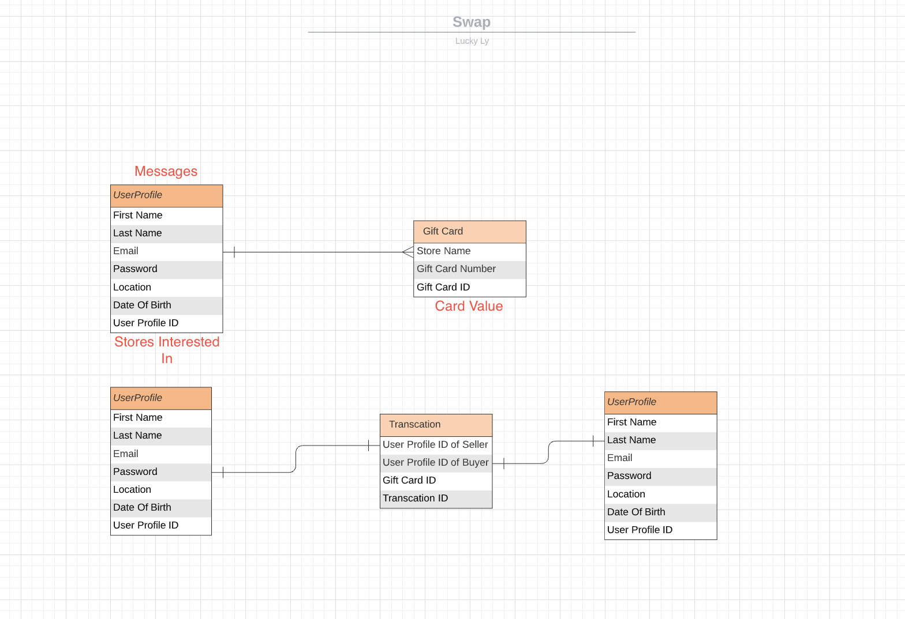
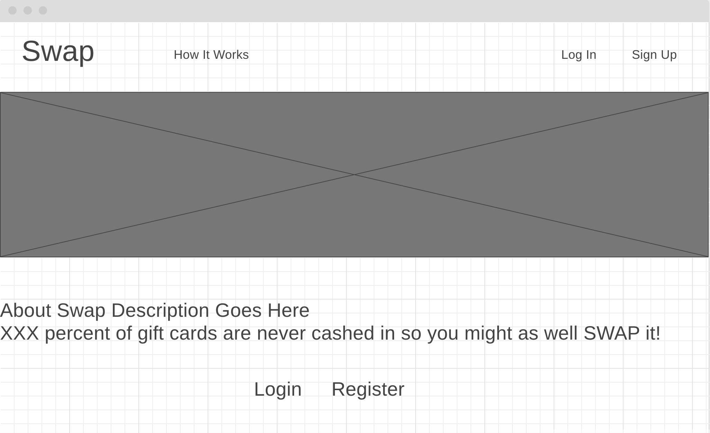
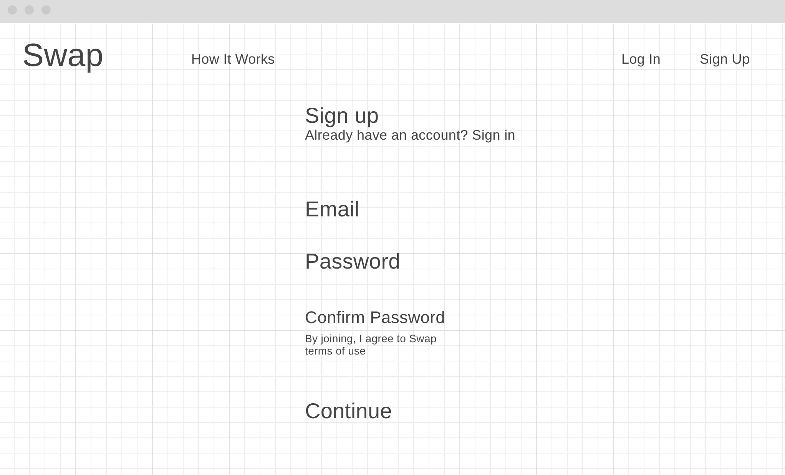
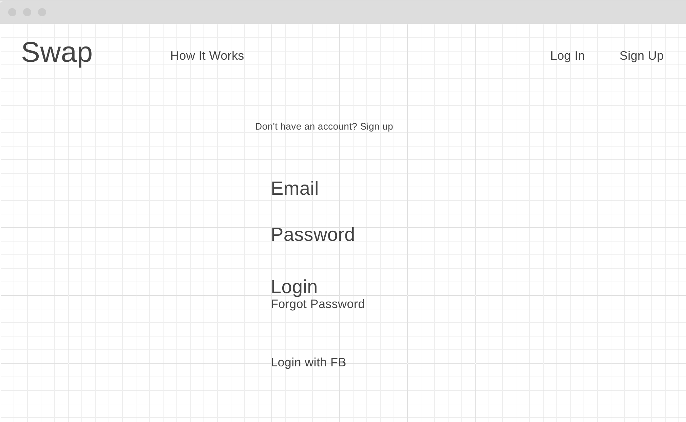
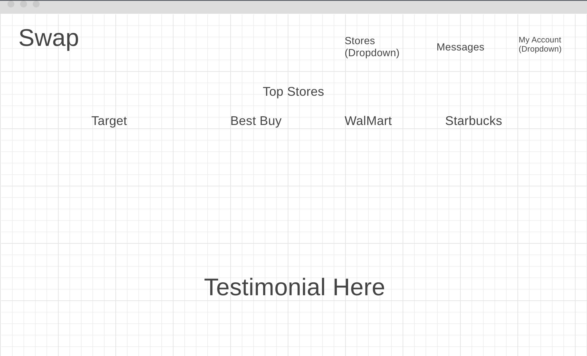
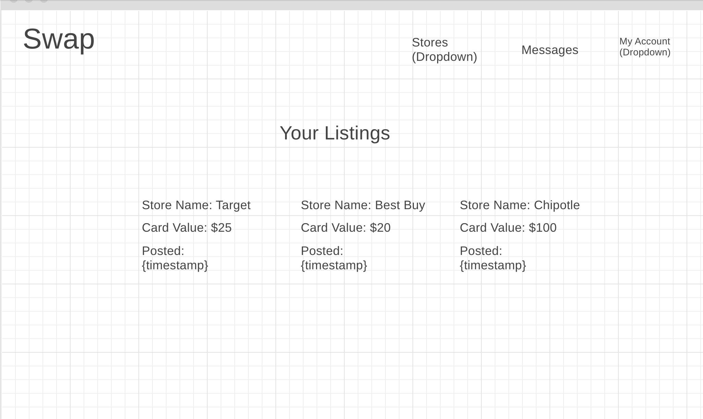
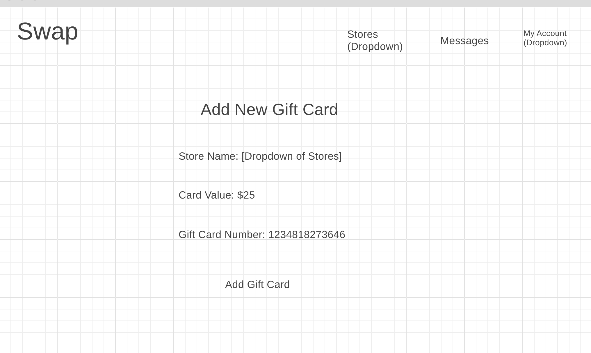
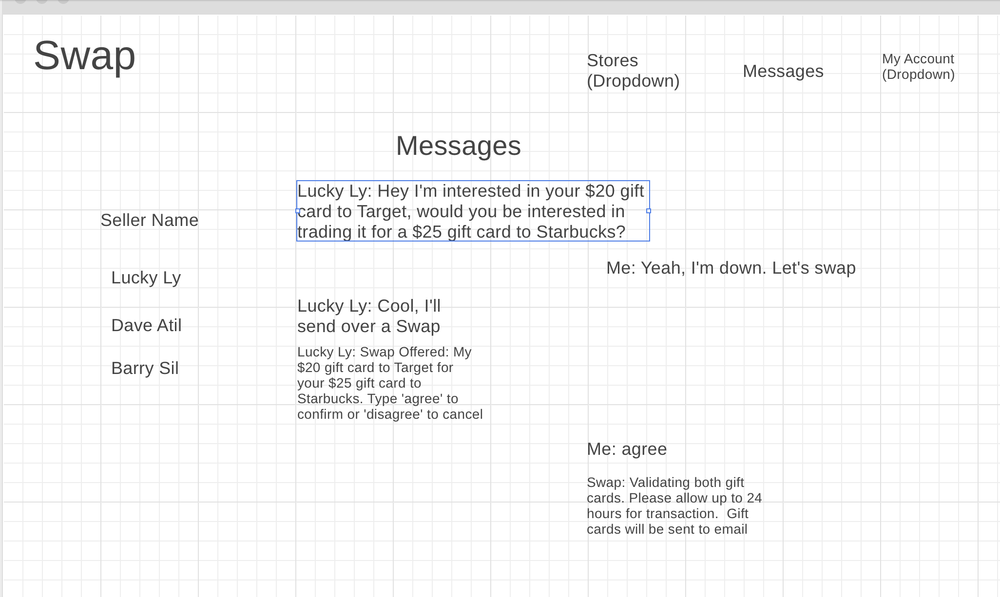

# Swap
### Overview

Received a gift card from grandma that you will never use? Look no further cause Swap is here to help you trade in that gift card for something you will use. Swap turns your gift card into currency.  Some people trade their gift cards for cash, some trade theirs in for gold. It's as simple as signing up and finding someone to swap with!

### Technologies Used

Backend  
    - MongoDb
    - Express
    - Node

Frontend  
    -React

### Installation

To use Swap, clone it down and install dependencies from NPM with npm using the command:

npm install

Then change directory into Swap-auth-API and using npm, type the command 

npm start

Your backend should be up and running. Now go back up a directory and change into Swap-auth-client. Using npm, type the command

npm start

Swap should be running on localhost:3000

# Wireframe

Entity Relationship Diagram

Landing Page

Register Page

Login Page

Profile Page

Listing Page

Add New Gift Card Page

User Messages Page

### Future Features

Personal Messaging
 
Automated GiftCard Validator
